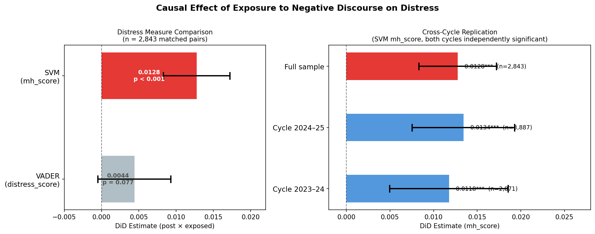
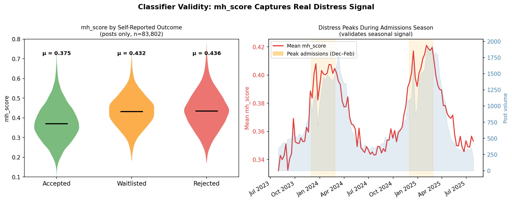
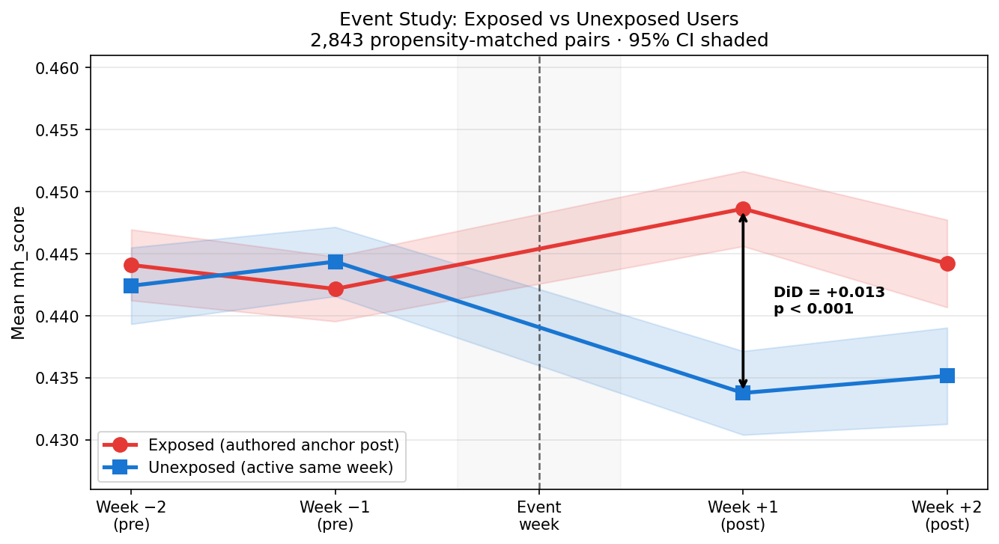

# You're Freaking Out and It Scares Me Too — Understanding How Exposure to Negative Discourse on r/GradAdmissions Affects Anxiety
---

Graduate admissions is stressful. But does *reading* other people's rejection posts make it worse? This project uses causal inference to find out — measuring whether exposure to high-distress posts on r/GradAdmissions increases anxiety in other users, and whether having a wider online social presence buffers that effect.

**Short answer**: Yes, and it doesn't buffer — it amplifies.

---

## Key Findings

| | |
|--|--|
| **RQ1** | Exposure to a negative anchor post increases a user's mental health distress score by **+0.013** in the following 1–2 weeks vs. matched unexposed users (p < 0.0001) |
| **RQ2** | Users with wider Reddit community presence show a **larger** distress response, not smaller — the stress-buffering hypothesis is not supported |
| **Replication** | Effect holds across both the 2023–24 and 2024–25 admissions cycles independently |

### RQ1 — Exposure increases distress

Users who authored a high-distress post showed a measurable increase in mental health distress in the following 1–2 weeks compared to matched users who were active the same week but didn't. The DiD estimate of **+0.013** on a 0–1 scale (corpus mean: 0.424) represents a ~3% relative increase. The effect is only significant with SVM classifiers (p < 0.0001) — VADER alone falls short (p = 0.077) because it conflates topic language ("rejected") with genuine distress.



### RQ2 — Community breadth amplifies, not buffers

The stress-buffering hypothesis predicts that users active across many subreddits would show a smaller distress response. The opposite is true: the moderation coefficient is **+0.003** (p = 0.014), meaning higher breadth correlates with a *larger* effect. At median breadth, the total DiD is +0.020. This may reflect an activity confound — more active users encounter more negative content overall — or that counting subreddits is a poor proxy for meaningful social support.

### Classifier validity

The SVM `mh_score` correctly orders posts by self-reported outcome: Rejected (0.451) > Waitlisted (0.446) > Accepted (0.401), and peaks seasonally in December–February when admissions decisions arrive.



### Event study — parallel trends confirmed

Exposed and unexposed users track identically in the two weeks before the anchor event, then diverge after it — the key validity check for the DiD design.



For full regression tables and all figures, see [Results](docs/results.md).

---

## How It Works

```
Raw Reddit data (r/GradAdmissions, Aug 2023–Jul 2025)
        ↓
    VADER scoring + SVM mental-health classifiers
        ↓
    Anchor event identification (7,075 distressed posts)
        ↓
    Propensity-score matched DiD regression
        ↓
    RQ1: Does exposure increase distress?
    RQ2: Does community breadth moderate the effect?
```

The distress measure is a composite SVM score (`mh_score`) trained on r/anxiety, r/depression, and r/stress posts — more sensitive than VADER alone.

---

## Repository Structure

```
├── notebooks/                  # Run these in order (01 → 06)
│   ├── 01_score_corpus.ipynb
│   ├── 02_anchor_events.ipynb
│   ├── 03_did_analysis.ipynb   # VADER baseline (optional)
│   ├── 04_collect_community_breadth.ipynb
│   ├── 05_train_classifiers.ipynb
│   └── 06_did_analysis_v2.ipynb  ← main results
│
├── data/
│   ├── raw/                    # Raw JSONL files (not in repo — too large)
│   └── processed/              # Intermediate parquets (most included)
│
├── models/                     # Trained SVM classifiers
├── figures/                    # All output plots
└── docs/                       # Detailed documentation
```

---

## Documentation

| Doc | What's in it |
|-----|-------------|
| [Quickstart](docs/quickstart.md) | How to set up and run the full pipeline from scratch |
| [Pipeline](docs/pipeline.md) | What each notebook does, inputs/outputs, runtimes |
| [Results](docs/results.md) | Full results tables, figures, and interpretation |
| [Methodology](docs/methodology.md) | Terminology glossary, design choices, limitations |

---

## Dataset

469,163 posts and comments from r/GradAdmissions (Aug 2023 – Jul 2025).
Raw data is not included in this repo due to file size. See [Quickstart](docs/quickstart.md) for how to obtain it.

---

## References

- Low et al. (2020). Natural language processing reveals vulnerable mental health support patterns in a COVID-19 crisis forum. *JMIR Mental Health*.
- Hutto & Gilbert (2014). VADER: A parsimonious rule-based model for sentiment analysis of social media text. *ICWSM*.
- Arctic Shift API: https://github.com/ArthurHeitmann/arctic_shift
