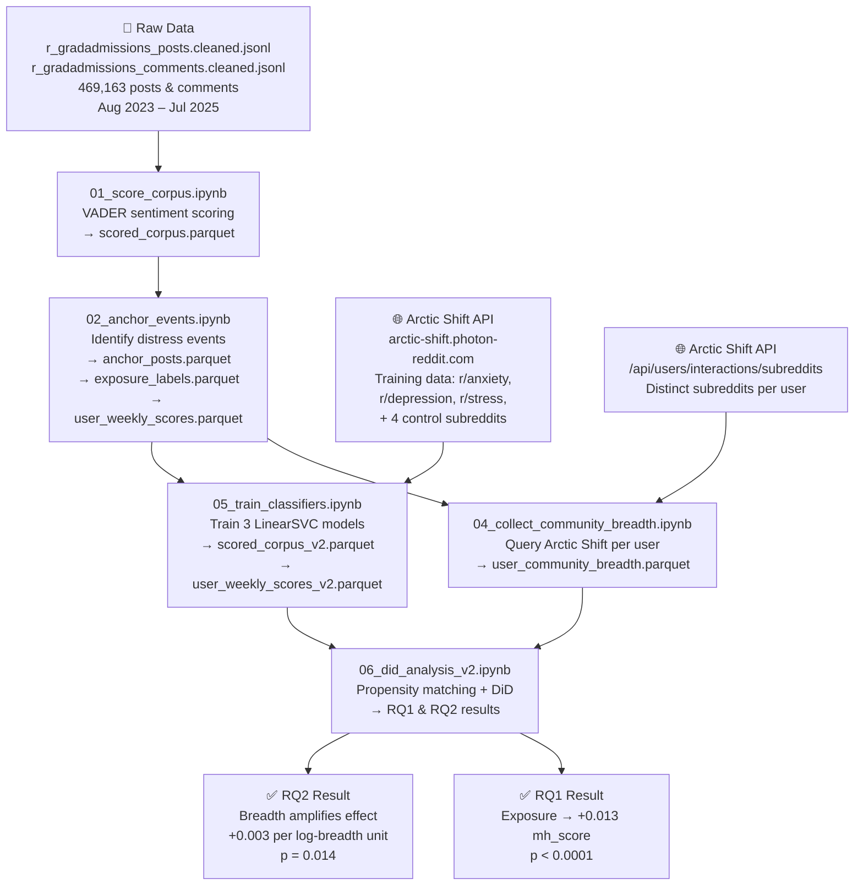
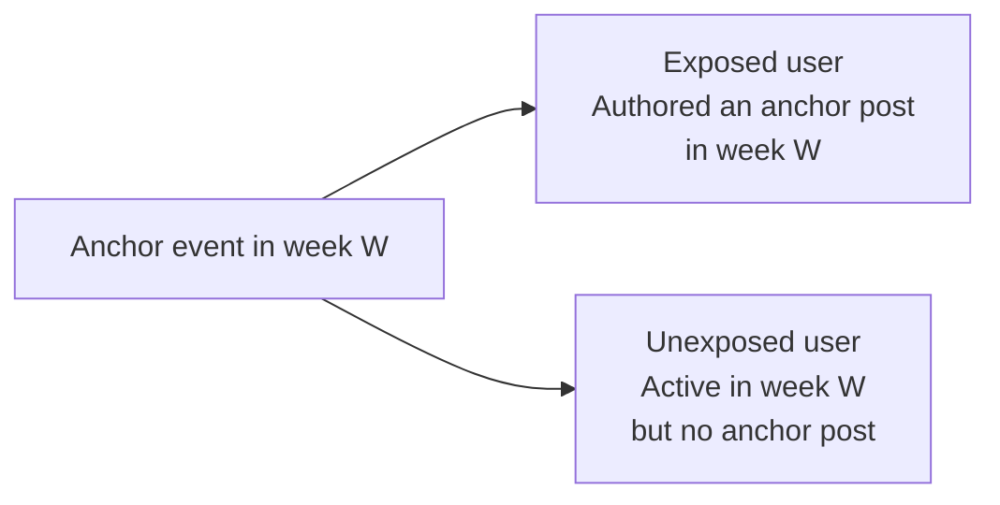
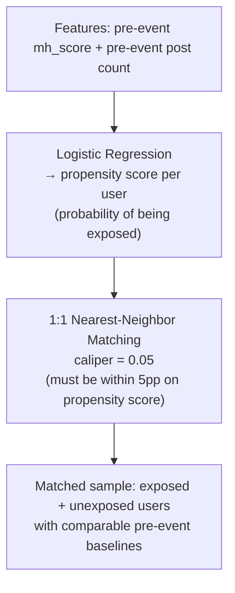
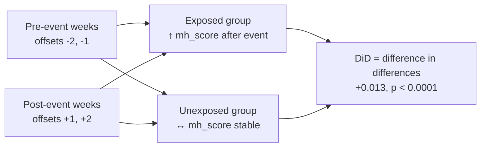
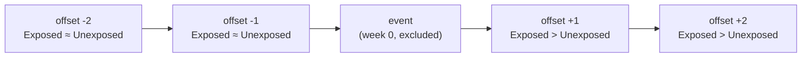

# Pipeline Flow — End to End

This document explains every step of the research pipeline: what each notebook does, why, and how it all connects to answer the two research questions.

---

## High-Level Flowchart



---

## Stage 1 — Measuring Distress

### Notebook 01 — VADER Scoring (baseline)

VADER is a rule-based sentiment lexicon (~7,500 words with pre-assigned scores). Every post and comment gets scored:

- `vader_compound` ∈ [−1, 1] — overall sentiment
- `distress_score` = `vader_neg` — fraction of negative words

**Limitation**: VADER sees "rejected" as negative whether someone is venting distress *or* asking "what rejection rate is normal?" It conflates topic language with emotional state. This is why VADER alone only reaches p = 0.077 in the DiD — not enough signal.

### Notebook 05 — SVM Mental Health Classifiers (main measure)

We follow the methodology from Low et al. (2020), who train classifiers on mental health subreddits as a proxy for distress.

**Training data** (pulled from Arctic Shift, Jan 2022–Jul 2023):

| Class | Subreddits | Posts pulled |
|---|---|---|
| Positive (distressed) | r/anxiety, r/depression, r/stress | 2,000 each |
| Negative (control) | r/personalfinance, r/learnprogramming, r/todayilearned, r/careerguidance | 2,000 each |

The training window predates our study period (Aug 2023+) to prevent data leakage.

**Features**: TF-IDF on unigrams + bigrams, max 50,000 features, `sublinear_tf=True`, `min_df=3`. TF-IDF weights words that are frequent in a document but rare across documents — so "panic attack" scores high in r/anxiety posts but not in r/personalfinance posts.

**Model**: LinearSVC (`C=1.0`, `class_weight='balanced'`), validated with 5-fold cross-validation. Three separate classifiers are trained — one per mental health class.

**Scoring**: `decision_function()` (continuous distance from decision boundary) passed through sigmoid, then averaged:

```
mh_score = mean(
    sigmoid(anxiety_decision_function),
    sigmoid(depression_decision_function),
    sigmoid(stress_decision_function)
)
```

A post scoring 0.8 on all three is linguistically similar to r/anxiety, r/depression, and r/stress content simultaneously. A post scoring 0.1 looks like it belongs in the control subreddits.

**Output**: `scored_corpus_v2.parquet` — every record now has `mh_score` ∈ [0, 1].

---

## Stage 2 — Identifying Anchor Events

### Notebook 02 — Anchor Post Identification

An **anchor post** is a high-distress disclosure that serves as the causal event. Two conditions must both hold:

1. **Keyword match**: contains at least one of 18 regex patterns covering negative admissions outcomes and emotional distress language (e.g., `\breject(ed|ion)\b`, `\banxi(ous|ety)\b`, `\bfalling apart\b`, `\bcan't cope\b`)
2. **Distress threshold**: `vader_compound < −0.05` OR `vader_neg > 0.10` — the post is genuinely distressed, not just on-topic

Posts with Reddit outcome flair `Rejected` or `Waitlisted` are also included if they pass the distress threshold (self-labeled by the author).

**Result**: 7,075 anchor posts identified across 104 weeks.

**User-weekly aggregation**: For every `(author, week)` pair, compute the mean `mh_score` across all their activity that week. This is the **outcome variable** for DiD.

**Exposure classification**:



---

## Stage 3 — Community Breadth

### Notebook 04 — Arctic Shift User Queries

For RQ2, we need to know how many subreddits each user participates in outside r/GradAdmissions.

**API call per user**:
```
GET /api/users/interactions/subreddits
    ?author={username}
    &after=2023-08-01
    &before=2025-07-31
```

**community_breadth** = count of distinct subreddits returned, excluding r/gradadmissions itself. Log-transformed (`community_breadth_log`) before regression to handle the right-skewed distribution.

The script saves a checkpoint every 500 users — safe to interrupt and resume (~25,000 users at 2.5 req/sec takes ~3 hours).

---

## Stage 4 — Causal Inference

### Notebook 06 — DiD Analysis

#### Step A — Propensity Score Matching

Exposed users (those who posted anchor posts) may already be more distressed than unexposed users — not because of the event, but because they were always more distressed. PSM corrects for this.



After matching, the two groups have statistically similar pre-event mh_scores and posting volumes. Any post-event difference is more plausibly *caused* by exposure.

#### Step B — Difference-in-Differences (RQ1)

We build a ±2 week panel around each anchor event (week 0 excluded):

```
pre-period: offsets -2, -1  →  post = 0
post-period: offsets +1, +2  →  post = 1
```

Regression formula:
```
mh_score ~ post + exposed + post×exposed + log(n_posts)
```

| Term | What it captures |
|---|---|
| `post` | General time trend — scores change post-event for everyone |
| `exposed` | Baseline difference — exposed users may start higher |
| `post × exposed` | **The DiD estimate** — additional change for exposed users post-event |
| `log(n_posts)` | Controls for posting volume (more posts = more stable score) |

HC3 robust standard errors are used throughout — these don't assume equal error variance across users (important when activity levels vary widely).

**Result**: DiD = **+0.013** (95% CI [0.010, 0.016]), p < 0.0001.



#### Step C — Moderation by Community Breadth (RQ2)

The **stress-buffering hypothesis** predicts: users active in more subreddits have broader social support networks, so they should show a *smaller* distress response.

Extended regression:
```
mh_score ~ post + exposed + post×exposed
         + community_breadth_log
         + post×exposed×community_breadth_log
         + log(n_posts)
```

The triple interaction `post×exposed×breadth_log` is the key term — it measures whether breadth changes the size of the DiD effect.

**Result**: coefficient = **+0.003**, p = 0.014.

The stress-buffering hypothesis is **not supported**. Higher breadth is associated with a *larger* distress response. Possible explanations:
- Highly active users encounter more negative content across the platform generally
- Subreddit count is a poor proxy for meaningful social support
- Active users may be more emotionally invested in the outcome of their applications

#### Step D — Validity Checks

**Parallel trends (event study)**:



The two groups track together before the event (parallel pre-trends) and diverge after — confirming the DiD assumption holds.

**Cross-cycle replication**: The full DiD is run separately on 2023–24 and 2024–25 admissions cycles. Both cycles show significant effects independently, ruling out a single-year anomaly.

---

## File Output Summary

| Notebook | Key output files |
|---|---|
| 01 | `data/processed/scored_corpus.parquet` |
| 02 | `data/processed/anchor_posts.parquet`, `exposure_labels.parquet`, `user_weekly_scores.parquet` |
| 04 | `data/processed/user_community_breadth.parquet` |
| 05 | `models/clf_anxiety.joblib`, `clf_depression.joblib`, `clf_stress.joblib`, `data/processed/scored_corpus_v2.parquet`, `user_weekly_scores_v2.parquet` |
| 06 | `figures/fig_event_study_v2.png`, `figures/fig_did_results_v2.png` |

---

## Why the Design Is Credible

| Concern | How it is addressed |
|---|---|
| Distressed users just post more | PSM equalizes pre-event posting volume |
| VADER captures topic, not distress | Replaced with SVMs trained on mental health communities |
| Exposed users were already more distressed | PSM matches on pre-event mh_score |
| No parallel pre-trends = invalid DiD | Event study confirms flat pre-trends at −2, −1 |
| Heteroskedastic errors inflate significance | HC3 robust standard errors throughout |
| Single-year fluke | Cross-cycle replication across 2023–24 and 2024–25 |
