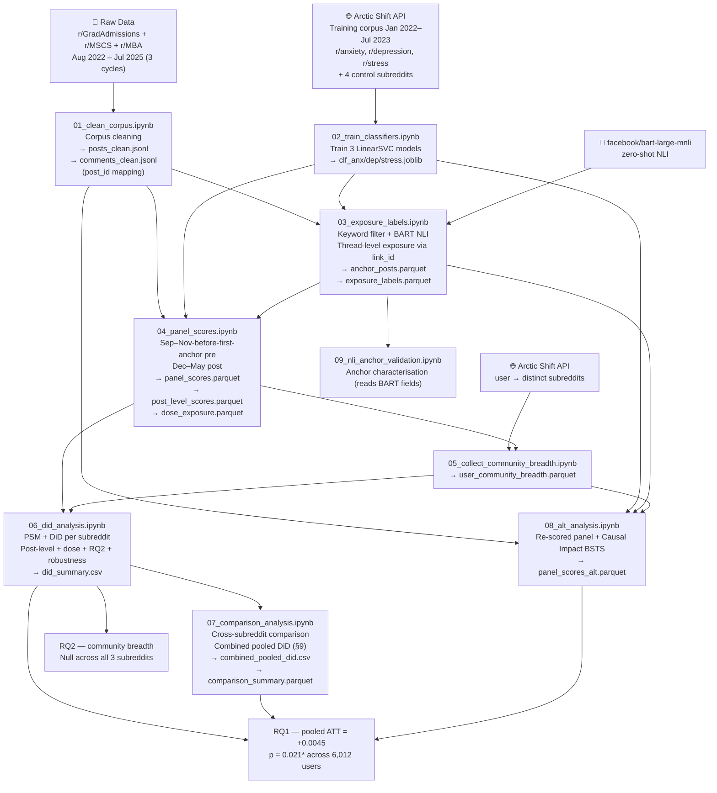

# Pipeline Flow — End to End

Every step of the research pipeline: what each notebook does, why, and how it all connects.

For per-notebook details, see [Pipeline](pipeline.md). For result numbers, see [Results](results.md).

---

## High-Level Flowchart



The pipeline runs once per subreddit (NB01–NB06, NB08), then NB07 and NB09 run cross-subreddit at the end. Orchestrated by `run_pipeline.py`.

---

## Stage 1 — Cleaning the Corpus

### Notebook 01 — Corpus Cleaning

Reads the raw JSONL dumps for the chosen subreddit (concatenating 2022 + main files where both exist) and produces canonical clean files.

**Key output — `post_id` on comments**: each comment gets `post_id = link_id.removeprefix("t3_")`. This directly links a comment to its parent post thread; without it, exposure can only be approximated. With it, exposure is based on actual thread participation.

**Text normalisation**: lowercase → strip URLs → strip non-alpha → collapse whitespace → `clean_text`.

**Outputs**: `data/processed/{SUBREDDIT}/posts_clean.jsonl`, `comments_clean.jsonl`.

> NB01 is skipped for r/MBA — its cleaned files are decompressed from `data/mba/*.jsonl.gz`.

---

## Stage 2 — Measuring Distress

### Notebook 02 — SVM Classifiers

Three binary LinearSVCs (anxiety / depression / stress) trained on mental health subreddit posts (positive) vs four general-topic control subreddits (negative), following Low et al. (2020).

**Why not VADER?** VADER assigns negative sentiment to any negative word regardless of context — "I got rejected, what are my chances next cycle?" scores as distressed even though the poster is pragmatic. The SVMs learn the *style* of distressed writing — self-referential framing, help-seeking language, vocabulary specific to mental-health communities.

**Composite**: `mh_score = mean(sigmoid(anx_df), sigmoid(dep_df), sigmoid(str_df))` ∈ (0, 1). Higher = more distress-like writing. Scoring uses `decision_function` + sigmoid, not `predict_proba` — `LinearSVC` doesn't expose calibrated probabilities.

**Outputs**: `models/clf_anxiety.joblib`, `clf_depression.joblib`, `clf_stress.joblib`.

> Don't re-run NB02 — it makes Arctic Shift API calls and will time out.

---

## Stage 3 — Defining Exposure

### Notebook 03 — Anchor Posts & Exposure Labels

Defines who is **exposed** (treated) and who is **unexposed** (control) for each subreddit × cycle.

**Anchor posts** are the treatment events: posts in the Sep–Nov anchor period that match at least one negative-admissions keyword **and** are classified as non-`general admissions discussion` by `facebook/bart-large-mnli` (with three negative candidate labels: `negative admissions outcome`, `rejection or funding loss`, `giving up on graduate school`).

> Earlier drafts used `mh_score > 0.45` from the SVM classifiers as the anchor rule. Replaced with the keyword + BART NLI rule on 2026-04-23 (commit `6b55593`) so the treatment definition no longer shares model weights with the outcome measure.

**Exposed users** commented on at least one anchor-post thread (matched via `link_id`). Anchor *authors* are excluded.

**Unexposed users** were active in the subreddit during the full Aug–May window of the cycle but never commented on any anchor thread.

Three cycles per subreddit:

| | Cycle 1 | Cycle 2 | Cycle 3 |
|-|---------|---------|---------|
| Anchor period | Sep–Nov 2022 | Sep–Nov 2023 | Sep–Nov 2024 |
| Active window | Aug 2022 – May 2023 | Aug 2023 – May 2024 | Aug 2024 – May 2025 |

**Outputs**: `anchor_posts.parquet` (with BART fields), `exposure_labels.parquet` (with `exposure_intensity` and `exposure_prob`).

---

## Stage 4 — Building the Panel

### Notebook 04 — Panel Scoring

Scores each panel user's posts and comments in two windows:

- **Pre-baseline**: Sep–Nov *before* each user's first anchor comment (or full Sep–Nov for unexposed). Captures activity prior to treatment onset.
- **Post-outcome (Dec–May)**: decision season — offers, rejections, waitlists.

Also produces a post-level dataset (one row per post / comment) for the post-level DiD in NB06, and a dose-exposure dataset counting anchor-thread comments per user.

**Why Sep–Nov, not August?** August has only ~6.5 % panel coverage. Switching to Sep–Nov-before-first-anchor (commit `17db224`, 2026-04-13) raised coverage to ~36 % and increased matched pairs ~4×, without violating the no-contamination requirement.

**Outputs**: `panel_scores.parquet`, `post_level_scores.parquet`, `dose_exposure.parquet`.

### Notebook 05 — Community Breadth

Pulls each panel user's activity across Reddit via the Arctic Shift API and counts distinct subreddits (excluding the focal admissions sub + the user's own profile sub). This is the moderator variable for RQ2 (`community_breadth_log = log1p(breadth)`).

Failed fetches and deleted accounts are imputed to `breadth = 0` so that PSM never drops rows for missing breadth → 100 % coverage.

**Output**: `user_community_breadth.parquet`.

---

## Stage 5 — Causal Estimation

### Notebook 06 — PSM + DiD (per subreddit)

**Propensity Score Matching** (per cycle): 1:1 nearest-neighbour matching using logistic regression on `pre_mh_score + log1p(n_posts_pre) + community_breadth_log`. Caliper = 0.05. SMD balance checks confirm covariate balance before / after matching.

**Formal parallel-trends pre-test (§4a)**: in the pre-period only, regress `mh_score ~ week_number × exposed + controls + C(cycle_str)`. The `week × exposed` interaction is **n.s.** in every subreddit, every cycle, and pooled — assumption holds.

**User-level DiD** (long format, one row per user × period, HC3 SEs):

```
mh_score ~ period + exposed + period × exposed + log1p(n_posts) + C(cycle_str)
```

The `period × exposed` coefficient is the ATT. Run per cycle and pooled. Spec variants written to `did_summary.csv`:

- **Binary DiD** — main spec.
- **Intensity DiD** — `exposure_intensity` (BART top-neg score, 0–1) as the continuous treatment.
- **Exposure-Prob DiD** — `exposure_prob` (popularity-weighted) as treatment.
- **GPS-WLS** — Hirano–Imbens weighted least squares (weights are nearly degenerate, so this isn't the primary spec).
- **Per-dimension** — same OLS on `anx_score`, `dep_score`, `str_score`.
- **RQ2 breadth moderation** — three-way interaction with `community_breadth_log`.

**Post-level DiD** uses ~22 K individual post observations (matched authors only), with and without user fixed effects, with cluster SEs on author.

**Dose-response**: tests whether the effect scales with `log1p(n_anchor_comments)`.

**Robustness checks (§11)**: placebo test, tight Dec–Jan post-window, BART confidence sensitivity at 0.4 / 0.6.

**Per-subreddit pooled Binary DiD (cycle FE)**:

| Subreddit | ATT | p |
|-----------|-----|---|
| r/GradAdmissions | +0.0041 | 0.235 n.s. |
| r/MSCS | −0.0073 | 0.256 n.s. |
| r/MBA | +0.0065 | 0.019\* |

Individual subreddits are underpowered (especially MSCS at 240 matched pairs); significance is achieved in MBA and in the cross-community pooled spec (NB07 §9).

### Notebook 07 — Cross-Subreddit Comparison + Combined Pooled DiD

Runs after NB06 completes for all three subreddits. The **combined pooled DiD (§9)** stacks the per-subreddit matched long dataframes and runs OLS with subreddit + cycle fixed effects and HC3 SEs:

| ATT | 95 % CI | p | n users | n obs |
|-----|---------|---|---------|-------|
| **+0.0045** | [+0.0007, +0.0083] | **0.021\*** | 6,012 | 12,416 |

This is the headline cross-community result. Other NB07 sections cover anchor-post characteristics, pre/post `mh_score` distributions, pairwise Z-tests (all n.s.; no subreddit is significantly different from another), and a comprehensive summary table.

### Notebook 08 — Alternative Analysis: Re-Scored Panel + Causal Impact

Independent implementation. Re-scores raw text inline rather than reusing NB04's aggregates, and adds Bayesian Causal Impact (BSTS) as a second identification strategy.

**Re-scored DiD**: uses the same Sep–Nov-before-first-anchor pre-period, but with a different PSM matcher (LR without scaler, ball-tree NN). Result patterns track NB06.

**Causal Impact**: BSTS using the unexposed group as a synthetic control on weekly aggregated `mh_score`. Pre = Sep–Nov, intervention = Dec 1, post = Dec 1 – May 31. Does not require individual pre + post coverage — every user with any weekly activity contributes.

The CausalImpact figures show positive relative effects across all subreddits and cycles, consistent in sign with the PSM-DiD estimates.

### Notebook 09 — Anchor Characterisation

Reads BART fields already saved in each `anchor_posts.parquet` (no inference). Produces summary stats (label distributions, BART top-neg score quartiles, per-cycle / per-subreddit counts) and `fig_nli_validation_scores.png`.

---

## Data Flow Summary

```
data/raw/* + data/mba/*.gz
    └─ NB01 ──► data/processed/{sub}/posts_clean.jsonl
                                     comments_clean.jsonl
                    │
                    ├─ NB03 ◄── NB02 (models/) + BART NLI
                    │    └──► data/processed/{sub}/anchor_posts.parquet
                    │                            exposure_labels.parquet
                    │               │
                    └─ NB04 ◄───────┘ + models/
                        └──► data/processed/{sub}/panel_scores.parquet
                                                   post_level_scores.parquet
                                                   dose_exposure.parquet
                                    │
                            NB05 ◄──┘ + Arctic Shift API
                             └──► data/processed/{sub}/user_community_breadth.parquet
                                            │
                            NB06 ◄──────────┘
                             └──► did_summary.csv, parallel_trends_test_v2.csv
                                  + figures/{att_coef, parallel_trends, parallel_trends_pretest}_{sub}.png
                                            │
                            NB07 (after all 3 subs) ──► combined_pooled_did.csv
                                                       comparison_summary.parquet
                                                       figures/fig_att_comparison.png

data/processed/{sub}/{posts,comments}_clean.jsonl ──► NB08 ◄── NB03 + NB02 + NB05
                                                       └──► panel_scores_alt.parquet
                                                           figures/fig_causal_impact_cycle*_{sub}.png
                                                           figures/fig_parallel_trends_alt_{sub}.png

data/processed/{sub}/anchor_posts.parquet ──► NB09 ──► figures/fig_nli_validation_scores.png
```
