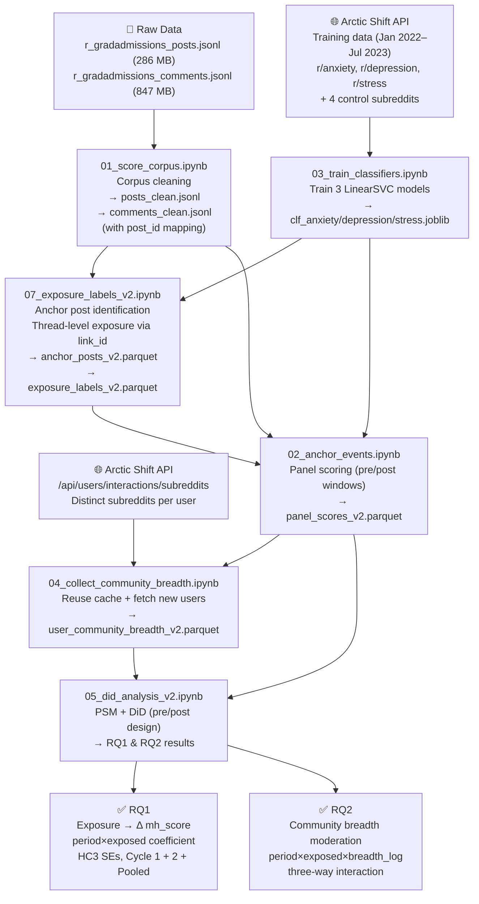

# Pipeline Flow — End to End

This document explains every step of the research pipeline: what each notebook does, why, and how it all connects to answer the two research questions.

---

## High-Level Flowchart



---

## Stage 1 — Cleaning the Corpus

### Notebook 01 — Corpus Cleaning

Reads the raw JSONL dumps (not pre-cleaned) and produces canonical clean files for all downstream notebooks.

**Key output — `post_id` on comments**: each comment gets a `post_id` field derived from its `link_id` (stripping the Reddit `t3_` prefix). This directly links a comment to its parent post thread and was missing from the old pipeline. Without it, exposure had to be approximated by same-week activity; now it is based on actual thread participation.

**Text normalization** produces a `clean_text` field: lowercase → strip URLs → strip non-alphanumeric → collapse whitespace. The original body is preserved separately.

---

## Stage 2 — Measuring Distress

### Notebook 03 — SVM Classifiers

Three binary SVMs (anxiety / depression / stress) are trained on mental health subreddit posts vs. control subreddit posts, following Low et al. (2020).

**Why not VADER?** VADER assigns a negative score to any negative word regardless of context. "I got rejected, what are my chances next cycle?" scores as distressed even though the poster is being pragmatic. The SVMs learn the *style* of distressed writing — the self-referential framing, help-seeking language, and emotional vocabulary specific to mental health communities. They generalise much better to distress in an academic stress context.

**Composite**: `mean_mh_score = mean(anx_score, dep_score, str_score)` ∈ (0, 1). Higher = more distress-like language.

---

## Stage 3 — Defining Exposure

### Notebook 07 — Anchor Posts & Exposure Labels (v2)

Defines who is **exposed** (treated) and who is **unexposed** (control) for each admission cycle.

**Anchor posts** are the "treatment events": high-distress posts in the Sep–Nov anchor period that match negative admissions keywords and score above `mean_mh_score > 0.45`.

**Exposed users** are those who commented on an anchor post thread — identified via `link_id` matching, not same-week activity. Anchor post authors themselves are excluded (they authored the distress, they weren't passively exposed to it).

**Unexposed users** were active in the subreddit across the full Aug–May window but never commented on any anchor thread.

Two cycles are processed independently:

| | Cycle 1 | Cycle 2 |
|-|---------|---------|
| Anchor period | Sep–Nov 2023 | Sep–Nov 2024 |
| Active window | Aug 2023–May 2024 | Aug 2024–May 2025 |

---

## Stage 4 — Building the Panel

### Notebook 02 — Panel Scoring

Scores each panel user's own posts and comments in two windows:

- **Pre-baseline (August)**: before the anchor period begins — captures baseline distress level
- **Post-outcome (December–May)**: after the anchor period — captures whether distress language changed

The SVM classifiers score every post/comment; scores are averaged per (user, cycle, window) to produce `pre_mh_score` and `post_mh_score`.

**Why August and December–May?** August is the quiet period before application season heats up — a clean baseline uncontaminated by admissions stress. December–May is peak decision season: offers, rejections, waitlists. If exposure to anchor posts during Sep–Nov shifts a user's distress trajectory, it should be detectable by comparing their August baseline to their Dec–May language.

### Notebook 04 — Community Breadth

Pulls each panel user's activity across all of Reddit to compute how many distinct communities they participate in. This is the moderator variable for RQ2.

**Reuse strategy**: the old pipeline already fetched breadth for ~25k users. Notebook 04 loads that cache and only queries Arctic Shift for new users in the v2 panel not already covered — avoiding redundant API calls.

`community_breadth_log = log1p(breadth)` is used in regression to handle the right-skewed distribution.

---

## Stage 5 — Causal Estimation

### Notebook 05 — PSM + DiD

**Propensity Score Matching** (per cycle): matches each exposed user to the most similar unexposed user on `pre_mh_score` + `pre_n_posts` (August baseline). Matching ensures that the exposed and unexposed groups had similar mental health language *before* any exposure occurred, making the post-period comparison causally cleaner.

**Difference-in-Differences** estimates the Average Treatment Effect on the Treated (ATT):

```
mh_score ~ period + exposed + period×exposed + log1p(n_posts)
```

The `period×exposed` coefficient is the DiD estimate — the *additional* change in mh_score for exposed users relative to the change for matched unexposed users. HC3 robust standard errors correct for heteroskedasticity.

**RQ2** adds a three-way interaction with `community_breadth_log` to test whether users with broader community networks experience a buffered (or amplified) response.

**Cross-cycle replication**: the full analysis is run separately for Cycle 1 and Cycle 2, then pooled with a cycle fixed effect. Consistent results across both cycles strengthen the causal interpretation.

---

## Data Flow Summary

```
data/raw/*.jsonl
    └─ NB01 ──► data/processed_v2/posts_clean.jsonl
                data/processed_v2/comments_clean.jsonl
                    │
                    ├─ NB07 ──► data/processed_v2/exposure_labels_v2.parquet
                    │                           anchor_posts_v2.parquet
                    │               │
                    └─ NB02 ◄───────┘ + models/clf_*.joblib
                        └──► data/processed_v2/panel_scores_v2.parquet
                                    │
                            NB04 ◄──┘ + Arctic Shift API (new users only)
                             └──► data/processed_v2/user_community_breadth_v2.parquet
                                            │
                            NB05 ◄──────────┘
                             └──► figures/ + regression tables
```
