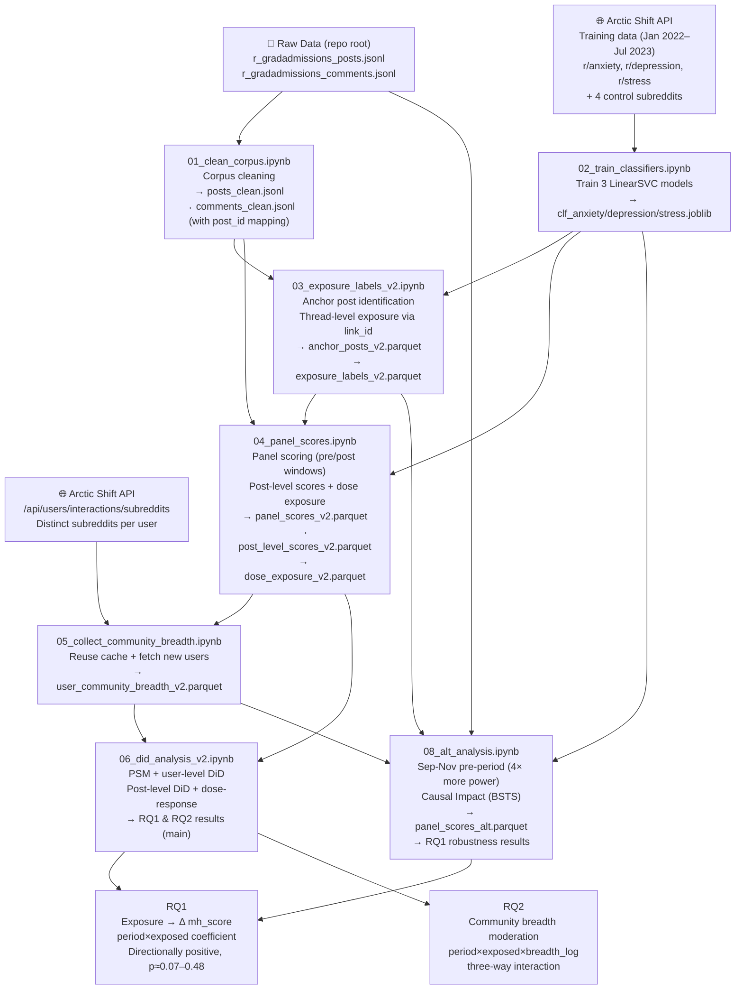

# Pipeline Flow — End to End

This document explains every step of the research pipeline: what each notebook does, why, and how it all connects.

---

## High-Level Flowchart



---

## Stage 1 — Cleaning the Corpus

### Notebook 01 — Corpus Cleaning (`01_clean_corpus.ipynb`)

Reads the raw JSONL dumps and produces canonical clean files for all downstream notebooks.

**Key output — `post_id` on comments**: each comment gets a `post_id` derived from its `link_id` (stripping the `t3_` prefix). This directly links a comment to its parent post thread. Without it, exposure can only be approximated by same-week activity; with it, exposure is based on actual thread participation (who replied to an anchor post).

**Text normalization** produces a `clean_text` field: lowercase → strip URLs → strip non-alphanumeric → collapse whitespace.

**Outputs**: `data/processed_v2/posts_clean.jsonl`, `data/processed_v2/comments_clean.jsonl`

---

## Stage 2 — Measuring Distress

### Notebook 02 — SVM Classifiers (`02_train_classifiers.ipynb`)

Three binary SVMs (anxiety / depression / stress) trained on mental health subreddit posts vs. general-topic control posts, following Low et al. (2020).

**Why not VADER?** VADER assigns negative scores to any negative word regardless of context. "I got rejected, what are my chances next cycle?" scores as distressed even though the poster is being pragmatic. The SVMs learn the *style* of distressed writing — self-referential framing, help-seeking language, emotional vocabulary specific to mental health communities.

**Composite**: `mh_score = mean(sigmoid(anx_df), sigmoid(dep_df), sigmoid(str_df))` ∈ (0, 1). Higher = more distress-like writing.

**Outputs**: `models/clf_anxiety.joblib`, `clf_depression.joblib`, `clf_stress.joblib`

---

## Stage 3 — Defining Exposure

### Notebook 03 — Anchor Posts & Exposure Labels (`03_exposure_labels_v2.ipynb`)

Defines who is **exposed** (treated) and who is **unexposed** (control) for each admissions cycle.

**Anchor posts** are the treatment events: high-distress posts in the Sep–Nov anchor period that match negative admissions keywords and score above `mh_score > 0.45`.

**Exposed users** are those who commented on an anchor post thread — identified via `link_id` matching against the anchor post ID list. Anchor post *authors* are excluded (they created the distress content; they weren't passively exposed to it).

**Unexposed users** were active in the subreddit across the full Aug–May window but never commented on any anchor thread.

Two cycles are processed independently:

| | Cycle 1 | Cycle 2 |
|-|---------|---------|
| Anchor period | Sep–Nov 2023 | Sep–Nov 2024 |
| Active window | Aug 2023–May 2024 | Aug 2024–May 2025 |

**Outputs**: `data/processed_v2/anchor_posts_v2.parquet`, `data/processed_v2/exposure_labels_v2.parquet`

---

## Stage 4 — Building the Panel

### Notebook 04 — Panel Scoring (`04_panel_scores.ipynb`)

Scores each panel user's posts and comments in two windows:

- **Pre-baseline (August)**: before the anchor period — captures baseline distress level
- **Post-outcome (December–May)**: decision season — captures whether distress language changed

Also produces a post-level dataset (one row per post/comment) for post-level DiD in NB06, and a dose-exposure dataset counting anchor comment threads each user engaged with.

**Why August and December–May?** August is the quiet period before application season — a clean baseline. December–May is peak decision season: offers, rejections, waitlists. The limitation: August activity is sparse, yielding only ~6.5% user coverage. NB08 addresses this.

**Outputs**: `data/processed_v2/panel_scores_v2.parquet`, `post_level_scores_v2.parquet`, `dose_exposure_v2.parquet`

### Notebook 05 — Community Breadth (`05_collect_community_breadth.ipynb`)

Pulls each panel user's activity across all of Reddit to compute how many distinct communities they participate in. This is the moderator variable for RQ2 (`community_breadth_log = log1p(breadth)`).

Reuses the old pipeline's cache and only queries Arctic Shift for new users.

**Output**: `data/processed_v2/user_community_breadth_v2.parquet`

---

## Stage 5 — Causal Estimation

### Notebook 06 — PSM + DiD (`06_did_analysis_v2.ipynb`)

**Propensity Score Matching** (per cycle): 1:1 nearest-neighbor matching using logistic regression on `pre_mh_score + log1p_n_posts_pre`. Caliper = 0.05. SMD balance checks confirm covariate balance pre/post matching.

**User-level DiD** estimates ATT:
```
mh_score ~ period + exposed + period×exposed + log1p_posts
```
The `period×exposed` coefficient is the DiD estimate. HC3 robust SEs correct for heteroskedasticity.

**Post-level DiD** uses 22,355 individual post observations (vs. ~562 in user-level), with and without user fixed effects and with cluster SEs on author. Provides more power and tests whether the effect is consistent at fine granularity.

**Dose-response**: tests if effect scales with number of anchor threads a user engaged with — a key causal validity check.

**Current results**: all estimates directionally positive (+0.007 to +0.010) but not statistically significant (p = 0.21–0.48). Low power due to sparse August pre-period (~155 matched pairs/cycle).

### Notebook 08 — Alternative Analysis (`08_alt_analysis.ipynb`)

**Pre-period fix**: uses Sep–Nov activity *before* each user's first anchor comment as the baseline (instead of August). Coverage jumps from 6.5% → 36.5%, matched pairs from ~155 → 668.

**Causal Impact**: Bayesian structural time series using the unexposed group as a synthetic control. Operates on aggregated weekly mh_score — no individual pre+post coverage required.

**Current results**: pooled DiD = +0.0076, p = 0.067 (borderline); CausalImpact +2.1–2.7% relative effect. Both methods directionally consistent across both cycles.

---

## Data Flow Summary

```
r_gradadmissions_*.jsonl  (repo root, not in git)
    └─ NB01 ──► data/processed_v2/posts_clean.jsonl
                data/processed_v2/comments_clean.jsonl
                    │
                    ├─ NB03 ◄── NB02 (models/clf_*.joblib)
                    │    └──► data/processed_v2/exposure_labels_v2.parquet
                    │                           anchor_posts_v2.parquet
                    │               │
                    └─ NB04 ◄───────┘ + models/clf_*.joblib
                        └──► data/processed_v2/panel_scores_v2.parquet
                                            post_level_scores_v2.parquet
                                            dose_exposure_v2.parquet
                                    │
                            NB05 ◄──┘ + Arctic Shift API
                             └──► data/processed_v2/user_community_breadth_v2.parquet
                                            │
                            NB06 ◄──────────┘
                             └──► figures/ + RQ1/RQ2 tables

r_gradadmissions_*.jsonl ──► NB08 ◄── NB03 outputs + NB02 models + NB05 outputs
                              └──► data/processed_v2/panel_scores_alt.parquet
                                   figures/fig_causal_impact_*.png
                                   figures/fig_parallel_trends_alt.png
```
