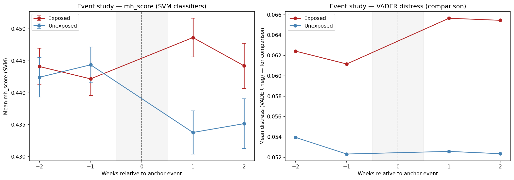

# Results

Full results from the DiD analysis using SVM mental-health classifiers. For methodology details, see [Methodology](methodology.md).

---

## RQ1 — Does Exposure Increase Distress?

**Question**: Do users who author a high-distress anchor post show a larger increase in mental health distress in the following weeks compared to matched users who were active the same week but didn't?

**Short answer**: Yes.

### 2×2 Means (matched panel)

|  | Pre-event (weeks −2, −1) | Post-event (weeks +1, +2) | Change |
|--|--------------------------|---------------------------|--------|
| **Exposed** | 0.4430 | 0.4467 | +0.0037 |
| **Unexposed** | 0.4435 | 0.4344 | −0.0091 |
| **DiD** | | | **+0.0128** |

The unexposed group's distress *decreases* slightly after the event week (natural regression to the mean), while the exposed group's stays elevated — producing the DiD effect.

### Regression Table

`mean_mh_score ~ post + exposed + post×exposed + log(1 + n_posts)`, HC3 standard errors, matched panel (n = 12,806 observations, 2,843 pairs)

| Term | VADER coef | VADER p | SVM coef | SVM p |
|------|-----------|---------|---------|-------|
| post | −0.010 | < 0.001 | −0.005 | < 0.001 |
| exposed | −0.002 | 0.235 | −0.001 | — |
| **post × exposed** | **+0.004** | **0.077** | **+0.013** | **< 0.0001** |
| log(1 + n_posts) | −0.002 | 0.045 | — | — |

**The SVM measure is significant (p < 0.0001); VADER alone falls short (p = 0.077).** The SVM classifiers capture the linguistic style of distressed writing more precisely than VADER's general-purpose lexicon.

### Interpretation

A DiD estimate of +0.013 on a 0–1 scale, against a corpus mean of 0.424, represents a **≈3% relative increase** in mental health distress score. This is a short-term effect measured 1–2 weeks after the anchor event.

---

## Cross-cycle Replication

The analysis was run separately on each admissions cycle to rule out a single-season artifact.

| Admissions Cycle | DiD Estimate | p-value | |
|-----------------|-------------|---------|--|
| 2023–24 | +0.01177 | 0.0007 | *** |
| 2024–25 | +0.01343 | < 0.0001 | *** |

The effect is consistent across both cycles and actually slightly stronger in 2024–25.

---

## RQ2 — Does Community Breadth Moderate the Effect?

**Question**: Do users with a wider presence across Reddit (higher community breadth) show a *smaller* distress response — consistent with the stress-buffering hypothesis?

**Short answer**: No. Higher breadth amplifies the effect.

### Regression Table

`mean_mh_score ~ post + exposed + post×exposed + community_breadth_log + post×exposed×community_breadth_log + log(n_posts)`, HC3 SEs

| Term | Coef | p-value | |
|------|------|---------|--|
| post × exposed | +0.013 | < 0.0001 | *** |
| community_breadth_log | −0.001 | — | |
| **post × exposed × breadth_log** | **+0.003** | **0.014** | * |

The moderation coefficient is **positive** — the opposite of what the stress-buffering hypothesis predicts. For a user at median breadth (log(1 + 10) = 2.40), the total DiD effect is 0.013 + 0.003 × 2.40 = **+0.020**.

### Why might this be?

Several possible explanations:

1. **Activity confound** — breadth correlates with overall Reddit usage; more active users encounter more negative content everywhere, not just in r/GradAdmissions
2. **Emotional investment** — users embedded in many online communities may be more emotionally reactive to content within those communities
3. **Breadth ≠ support quality** — counting subreddits is crude; belonging to r/nba and r/cooking doesn't help with a rejection letter
4. **Reverse causality** — prior distress may lead users to seek out more communities, making breadth a consequence rather than a moderator

---

## Event Study Plot

The event study checks the parallel trends assumption — that exposed and unexposed users were on similar trajectories *before* the event, and diverged only *after*.

**Reading the plot**: Lines should track closely at offsets −2 and −1 (pre-period), and diverge at +1 and +2 (post-period). This pattern holds, supporting the causal interpretation.

---

## All Figures

| Figure | Description |
|--------|-------------|
| `fig_weekly_sentiment.png` | Weekly VADER sentiment + post volume — shows seasonal peaks (Dec–Feb) |
| `fig_anchor_posts_per_week.png` | Anchor posts per week — spikes align with rejection waves |
| `fig_anchor_eda.png` | Anchor post breakdown by outcome label and VADER distribution |
| `fig_community_breadth_dist.png` | Distribution of community breadth (raw + log-transformed) |
| `fig_breadth_by_exposure.png` | Community breadth: exposed vs unexposed comparison |
| `fig_event_study.png` | Event study using VADER distress (baseline comparison) |
| `fig_event_study_v2.png` | Event study using SVM mh_score — **main result figure** |
| `fig_classifier_scores.png` | Score distributions across the corpus for all three classifiers |
| `fig_score_correlation.png` | mh_score vs VADER correlation (r ≈ −0.35 with compound) |
| `fig_monthly_distress.png` | Monthly mean distress + post volume (seasonality check) |
