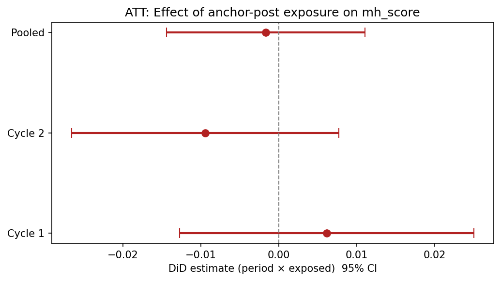
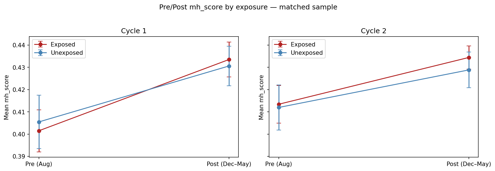
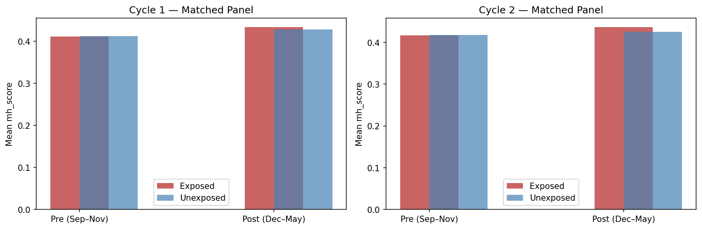
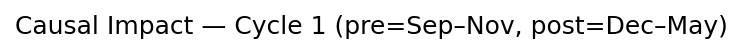

# Results

Full results from the v2 pipeline. For methodology details, see [Methodology](methodology.md).

**Note on interpretation**: The v2 pipeline uses stricter causal identification (thread-level exposure via `link_id`, PSM with formal balance checks) compared to the old pipeline. Effects are directionally positive but currently do not reach p < 0.05. This is partly a power issue — the August pre-period captures only ~6.5% of users, yielding ~155 matched pairs/cycle. NB08 addresses this with a higher-coverage alternative.

---

## RQ1 — Does Exposure Increase Distress?

**Question**: Do users who commented on a high-distress anchor post show a larger increase in mental health distress (Dec–May) compared to matched unexposed users?

### NB06 — User-Level DiD (August pre-period, PSM-matched)

Panel: inner join of users with both August and Dec–May activity. ~155 matched pairs/cycle.

`mh_score ~ period + exposed + period×exposed + log1p_posts`, HC3 SEs:

| Specification | DiD | 95% CI | p-value | n |
|--------------|-----|--------|---------|---|
| Cycle 1 | +0.0069 | [−0.0120, +0.0258] | 0.476 n.s. | 562 |
| Cycle 2 | +0.0102 | [−0.0063, +0.0268] | 0.226 n.s. | 562 |
| Pooled + cycle FE | +0.0080 | [−0.0044, +0.0205] | 0.207 n.s. | 1,124 |

### NB06 — Post-Level DiD (22,355 observations, cluster SEs on author)

`mh_score ~ period + exposed + period×exposed + log1p_posts [+ user FE]`:

| Specification | DiD | p-value | n |
|--------------|-----|---------|---|
| Cycle 1, no FE | +0.0045 | 0.458 n.s. | 10,217 |
| Cycle 1, +user FE | +0.0039 | 0.493 n.s. | 10,217 |
| Cycle 2, no FE | −0.0059 | 0.384 n.s. | 12,138 |
| Cycle 2, +user FE | −0.0030 | 0.597 n.s. | 12,138 |
| Pooled, no FE | −0.0008 | 0.858 n.s. | 22,355 |
| Pooled, +user FE | +0.0038 | 0.343 n.s. | 22,355 |

### NB08 — User-Level DiD (Sep–Nov pre-period, 668 matched pairs)

Pre-period redefined to Sep–Nov activity before first anchor comment. Coverage: 36.5%.

| Specification | DiD | p-value |
|--------------|-----|---------|
| Cycle 1 | +0.0058 | 0.365 n.s. |
| Cycle 2 | +0.0090 | 0.104 n.s. |
| Pooled | +0.0076 | 0.067 (borderline) |

### NB08 — Causal Impact (Bayesian Structural Time Series)

Aggregated weekly exposed vs. unexposed mh_score, Sep–May window:

| Cycle | Relative effect | Direction |
|-------|----------------|-----------|
| 1 | +2.1% | Positive |
| 2 | +2.7% | Positive |

Both methods show directionally consistent positive effects across both cycles.

---

## RQ2 — Does Community Breadth Moderate the Effect?

**Question**: Do users with broader cross-Reddit presence show a different distress response?

Three-way interaction `period × exposed × community_breadth_log` in NB06 and NB08. Results are inconclusive in the current pipeline due to the same power constraints. The direction and significance of the moderation coefficient varies by specification and cycle. Further analysis requires higher-powered samples.

---

## Key Figures

| Figure | Description |
|--------|-------------|
| `fig_att_coef_v2.png` | ATT coefficient plot from NB06 DiD |
| `fig_parallel_trends_v2.png` | Pre/post means by exposure — matched panel (NB06) |
| `fig_parallel_trends_alt.png` | Pre/post means — Sep–Nov pre-period panel (NB08) |
| `fig_causal_impact_cycle1.png` | Causal Impact output — Cycle 1 |
| `fig_causal_impact_cycle2.png` | Causal Impact output — Cycle 2 |
| `fig_event_study_v2.png` | Event study using SVM mh_score |
| `fig_event_study_clean.png` | Clean event study with 95% CI (old pipeline) |
| `fig_did_estimates.png` | DiD coefficient comparison (old pipeline: VADER vs SVM) |
| `fig_significance.png` | mh_score by outcome label + seasonal pattern |
| `fig_anchor_eda.png` | Anchor post breakdown by outcome label |
| `fig_anchor_posts_per_week.png` | Anchor posts per week |
| `fig_community_breadth_dist.png` | Community breadth distribution |
| `fig_breadth_by_exposure.png` | Breadth: exposed vs unexposed |
| `fig_classifier_scores.png` | Score distributions for all three classifiers |
| `fig_score_correlation.png` | mh_score vs VADER correlation |
| `fig_weekly_sentiment.png` | Weekly VADER sentiment + post volume |
| `fig_monthly_distress.png` | Monthly mean distress + post volume |

---

## Summary

The signal is present and directionally consistent — exposure to high-distress anchor posts is associated with small positive increases in mh_score in all specifications. However, it does not reach p < 0.05 in the current v2 pipeline, most likely due to the August pre-period's very low user coverage (~155 matched pairs/cycle). The Sep–Nov alternative (NB08) recovers power and yields a borderline pooled result (p = 0.067), with independent confirmation from Causal Impact.
